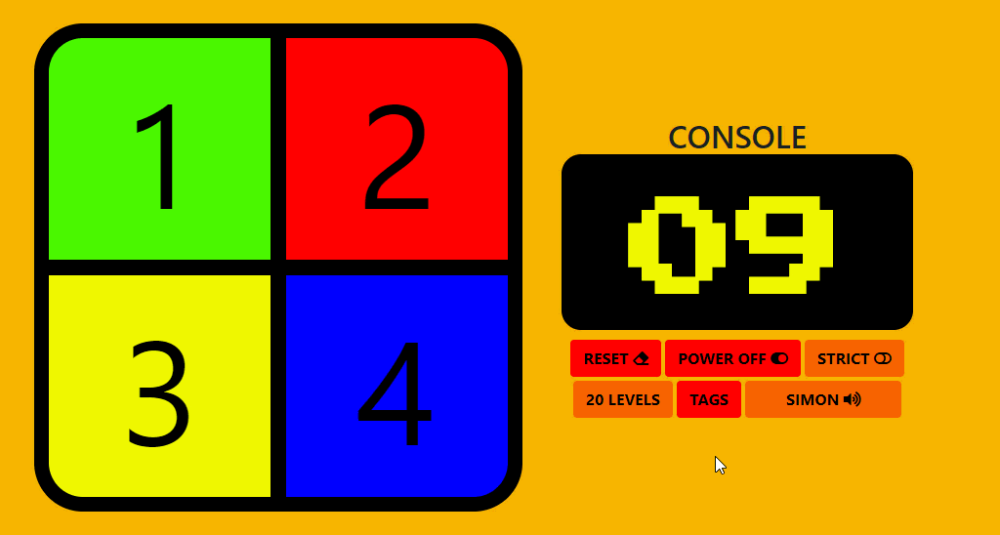
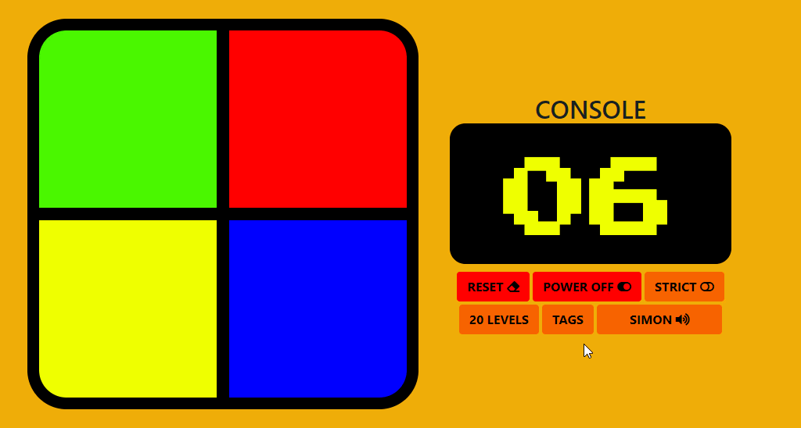

Project’s core functionality
============================

### Aim

To re-create the classic memory game of
“[SIMON](https://en.wikipedia.org/wiki/Simon_(game))” as a website, where the
user can play against the computer (Simon). The logic of the game was to be
written with JavaScript. The game’s aesthetics were to be done using the
conventional HTML/CSS technologies.

The focus of this project was on functionality and logic ONLY rather than
aesthetic. However, the website is fully responsive on variety of devices and
resolutions.

### What it does

Simon plays a randomly generated sequence for the player to repeat using colours
and tones. The player has the sole goal of repeating the same sequence as Simon
to win the game. The sequence will get longer and longer as the player
progresses to higher levels.

Features
========

The features of this game are split into two groups, the so called ‘core
features’ are needed for the game to function properly and the additional
features to make the experience more pleasant and fun for the player.

### Core features

1.  Smart Console

    Shows the level progression, resetting, wrong selections, winning, losing
    messages etc with an arcade themed font.

2.  Turn ON

    Powers on the game, will stand by until the player starts the game – Console
    aided.

3.  Turn OFF

    Powers off the game – Console aided.

4.  Start Game

    Initiates the game.

5.  Reset game

    

    Reset the current game - console aided.

6.  Simon play

    Will play its randomly generated sequence and depending on the selected
    mode, it will carry on playing the sequence until the user gets it right.
    Refer to ‘STRICT” mode.

7.  User play

    Will simulate player clicks on the coloured pads and keeps track of the
    player selections – Console aided.

8.  Check user sequence.

    

    Process the user selections. will decide if the player has won, lost, made
    the wrong selection and etc – Console aided.

9.  Strict mode

    

    While this mode is active, any wrong selections made by the player will end
    the game abruptly, as opposed to the ‘normal mode’ where the sequence will
    be repeatedly played until the player gets it right.

10. Nostalgic classic arcade tunes for different functions of the game.

### Additional features

1.  Hidden “CHEAT” Console

    

    Holding the “CTRL” key while the game is in session will slide in a hidden
    “CHEAT” console, granting the player the two abilities listed below via two
    buttons:

    -   Replay the current level sequence to jog player’s memory – Labelled
        “hint”.

    -   Skip the level entirely – Labelled “skip level”.

        -   Note: it will skip levels until the set or default number of levels
            has been reached, the last level (whatever it is, either the default
            of ‘20’ or player set via the set level button) has to be played by
            the player. For instance, if the player has set the number of levels
            to ‘6’, it will skip the level up until level ‘5’, the player has to
            select the right sequence on the last level in order to win the
            game.

        -   This feature also makes testing the game significantly easier.

2.  Level-Setter

    

    Using the “LEVELS” button, the maximum number of level can be manually set
    by the player.

    -   By default, the number of levels is to ‘20’.

    -   The minimum level that can be set by the player is ‘5’.

    -   The maximum level has no limit. It could be set to any integer.

3.  Sound Themes

    

    Multiple sound themes to choose from including ‘mute’, the list of which are
    listed below:

    -   Simon – default

    -   River Raid – Inspired by a classic Attari game [River
        Raid](https://en.wikipedia.org/wiki/River_Raid).

    -   Android

    -   High-pitched

    -   Mute – no sound

4.  Colour-blind friendly

    

    “TAGS” button – Toggle on and off numbers on the pads, making it easier for
    the colour-blind to keep track the sequence.

    -   By default, set to ‘OFF’.

5.  Multi-functional buttons

    -   “Power ON/OFF” button

    -   “PLAY/RESET” button

Technologies used
=================

1.  JavaScript

    -   Approximately 30 functions (5 nested).

2.  jQuery v3.3.1

    -   Used heavily throughout the project as main element selector with its
        built-in functions which made the whole process of writing this game
        easier.

3.  jQuery UI v1.12.1

    -   Used for the sliding animation of the cheat console, "puff" and “drop”.

4.  SASS

    -   Adopted main method of styling. Used with combination of SASS variables,
        mixins and functions in total of 7 scss files.

5.  HTML5

6.  CSS

    -   Used with SASS.

7.  Flexbox

    -   Primary tool for centring items.

8.  Bootstrap v4.1.0

    -   Used for theming a hand full of elements.

9.  Font Awesome v5.0.13

    -   Used on main, cheat console and footer.

10. Google fonts

11. Camtasia

    -   Used to record informative mini tutorials in gif format for the
        README.md file.

12. Gimp

    -   Used to alter the size, colour and transparency of the images for the
        website.

    -   Used to crop gif files.

13. Microsoft Word

    -   To write up the content of the README.md file.

14. Chrome and Firefox developer tools

    -   Used extensively for live-testing and running numerous different tasks.
        To name a few:

        -   Testing core functions.

        -   Website/grid responsiveness.

        -   Element Colours, style, opacity and etc.

        -   Aligning and centring.

        -   Attribute value search.

        -   Fluidity and core functionality of the website.

15. Git/Github

    -   Used to keep track of the project’s evolution with frequent commits and
        informative messages.

    -   GitHub was also used to access bootstrap’s source code.

16. Cloud9

    -   Used as the main editor.

Content and file management
===========================

### Logic

The logic is split into two scripts.

1.  “main.js”

where all the main logic is located.

The functions within the main script are categorised into four sections.

-   General – are the functions that are used through out the script and within
    other functions. To name a few

    -   pushToConsole() – to will print a value onto the console. It’s smart
        enough to distinguished between numbers and strings.

    -   getDisplayTxt() – fetches the content of console and its font size.

-   Click simulation – this function has two other nested functions which as the
    name suggests, simulates clicks and/or key pad presses.

-   User functions – this section handles User selections, analyses user data
    and decides whether the user/player has lost or won the game, and also
    caters for the strict mode of the game.

-   Simon – contains series of functions in charge of operating different game
    tasks such as play sequence and resetting the console. To name a few

    -   resetSimon()

    -   startSimon()

    -   intialiseSimon()

    -   simonPlay()

-   Handlers and other – series of functions to handle everything else within
    the script, from selecting elements on the screen to toggling classes and
    functions. These functions are used at the top of the script not only to
    reduce the amount of code but to make the code easier to follow.

1.  “audio.js”

    This script contains all the logic related to the audio aspects of the game.

-   Variable “soundTheme” – set the default sound theme.

-   SOUND_THEMES_OB - contains all the audio files.

-   Functions to play tunes, themes and toggle sound themes.

### Styling

1.  colors.scss - holds a pallet of colours in form of SASS maps.

2.  theming.scss – Allows selection of multiple background image.

3.  variables.scss – defines the variables used for mixins, functions, styling
    and the layout of the website.

4.  mixins.scss – holds all the functions and mixins used throughout the
    project.

5.  elements.scss – where the non-tag elements are defined using mixins and
    variables.

6.  layout.scss – controls the core layout of the website

7.  main.scss – main SCSS file. Puts everything together.

Testing
=======

### Logic Debugging

All the core functions within the main script are equipped with a debugging
system enable from within the function itself. This method of debugging is fast,
efficient and prevents the console from being spammed.

In a few lengthy functions where there were simply too many items being logged,
a tier system was introduced to control the volume of logs coming out of that
particular function.

### Responsiveness/Aesthetics Testing

The responsiveness, functionality, fluidity of each page was extensively and
virtually tested on all the Chrome/Firefox responsive tool’s available devices,
ranging from Amazon fire tablets to iPhone x. Additionally, every page was
numerously loaded on the following devices by various users in order to identify
possible malfunctions and misbehaving elements.

-   iPhone x

-   Google Pixel 2

-   iPhone 7 Plus

-   Nexus 6P

-   22inch Full HD 1080p monitor

-   25inch Quad HD 1440p screen

-   13inch Full HD screen of a Dell XPS Ultrabook.

Project deployment
==================

1.  Research

    I started this project by first researching and trying to gather as much
    information as possible about the game and its rules as I was very much
    unfamiliar to it. I studied the game quite thoroughly for a while before I
    started thinking about how I was going to start the project. After that, I
    identified the key features of the game and started looking into possible
    ways of coding such features and their feasibilities. For this I had to look
    into setInterval and setTimeout functions. I spent a good week or so trying
    to understand what these functions do and how I could use them to my
    advantage.

1.  Crude Layout

    After I managed to get a clear path in my head, I started researching on
    styling and possible layouts that I could adopt for this project. There was
    a vast amount information out there and the possibilities were endless
    hence, I decide to leave the styling for last as the logic was far more
    complex and needed more time spent on it. However, I still needed something
    to work with so I created a very crude layout with the bear minimum that was
    required, which in this case was just a few buttons and 4 coloured divs.

1.  Logic

    Click/key-press functions:

    Having spent some time on different approaches to this project, I determined
    that the “click simulation” is the first thing that needs to be tackled.
    Some sort of a function that once called, would press a key pad and then
    release it while playing a tune. So, this was the starting point for me, and
    it resulted in the creation of three very convoluted and long handed
    functions, which I later on merged into one function. I could invoke the
    function with an id and it would add the simulate a click on that specific
    key while playing a tone.

    Simon functions:

    I then moved on to generating a random list of numbers ranging from 1 to 4
    and using those generated numbers as input IDs(pads) for Simon to simulate
    clicks on. This was achieved with the setInterval function. This function
    was later on tweaked to give me “the developer” the ability to skip levels
    and/or jump to a specific level without having to complete the game or
    having to go through every level each time, which would have made the
    testing of the game crippling slow and frustrating. This feature of the
    function gave me the idea of making it accessible to the player as some sort
    of hidden console. I later on created a generic version of the function
    called “cheat()” with the player in mind, but after re-tweaking and
    fine-tuning my original function ( “simonPlay()” ) I decided to carry on
    using the main one since the generic function seemed so much like repeated
    unnecessary code. Either way, I held on to the function just in case if I
    ever needed to or decided to change the “simonPlay()” function.

    Console expansion:

    At this time, I decided to split the project into two sections, “CONSOLE”
    and “SIMON”, Simon being the ai player. I soon realised I needed to track
    whatever that was being done under the bonnet in an informative manner to
    keep the “developer” and the player in control and aware of what’s going on.
    Hence, I decided to expand on the console by making it bigger and smarter. I
    then created a function to push strings and numbers into the console which
    is scattered through out the project and used within other functions.

    User/player functions:

    I then started putting in place the user/player functions in charge of
    detecting and recording user selections. After that came the analysis of the
    collected user data, which had to decide if the player had lost or won the
    game, failed to get the sequence right, or completed the sequence correctly
    to be granted permission to advance to the next level.

    Decluttering console:

    After I got the logic working, I started working on multi-functional keys in
    an effort to reduce the number of buttons on the console. For instance, I
    merged “START” and “RESET” buttons into a single button by adding a toggle
    effect, the same approach was taken with the “POWER ON” and “POWER OFF”
    buttons.

    Cheat console:

    The jQueryUI was used to help with the animation of the hidden cheat
    console. it was then tested and its logic changed in such a way that it only
    works when the game is actually in session. The cheat console can also be
    summoned while the game is switched on but it wont actually do anything
    until the game has been initiated.

2.  Nav and footer

    Navbar and footer were added and restyled to match the theme of the game.

1.  Responsiveness and fine-tuning

    The website was finally made fully responsive and tested on variety of
    devices on multiple platforms.

2.  Final deployment (Git/Github)

    Throughout the project git was used to back up the code and then pushed to
    Github with the total number of commits reaching nearly 40.

Issues and bugs
===============

-   Items looked very small on high resolution desktop screens (1440p panel) and the  
    website wouldn’t cover the entire window – this issue was resolved with
    introduction of media queries directed to the min/max height rather than width

-   Issue with items not fitting or sticking out their containers on
    small-factor high resolution screens (XPS 13 – 13-inch FHD screen) where the
    scale was set to 125% - this issue was again resolved by introducing more
    media queries.
